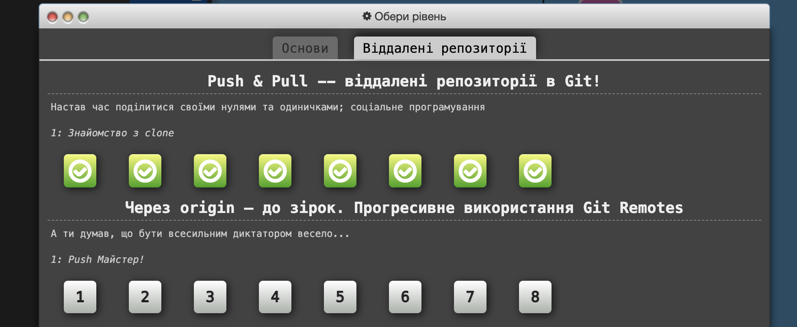
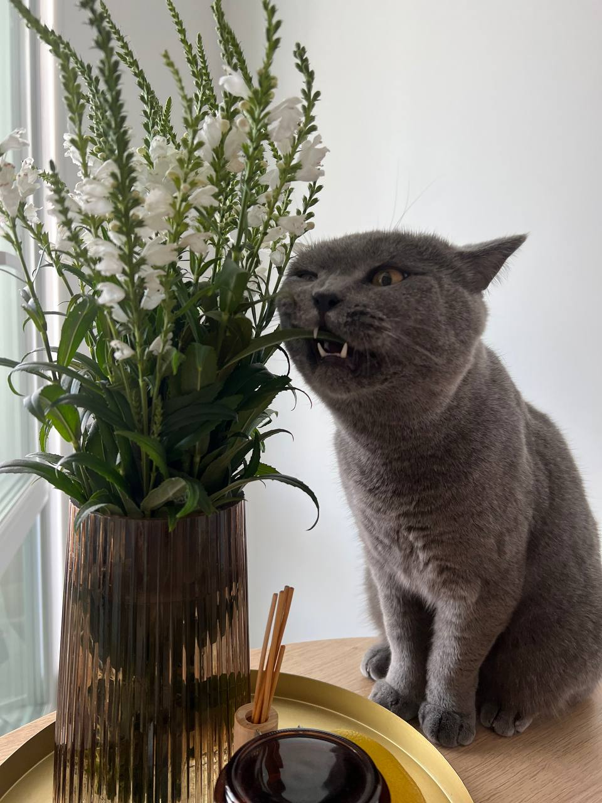

# kottans-frontend

## Hi everyone 🙃

I'm Olena. I’m excited to join the kottans community.
First of all, I wanna thank the organizers and developers for the opportunity to take this course. I hope I'll be able to complete all the tasks and continue my studies at the next levels.

### GIT

Screenshot

Screenshot

**My kottans**
