# kottans-frontend

## Hi everyone 🙃

I'm Olena. I’m excited to join the kottans community.
First of all, I wanna thank the organizers and developers for the opportunity to take this course. I hope I'll be able to complete all the tasks and continue my studies at the next levels.

  
**My disobedient kottans**

## 0.GIT

Screenshot

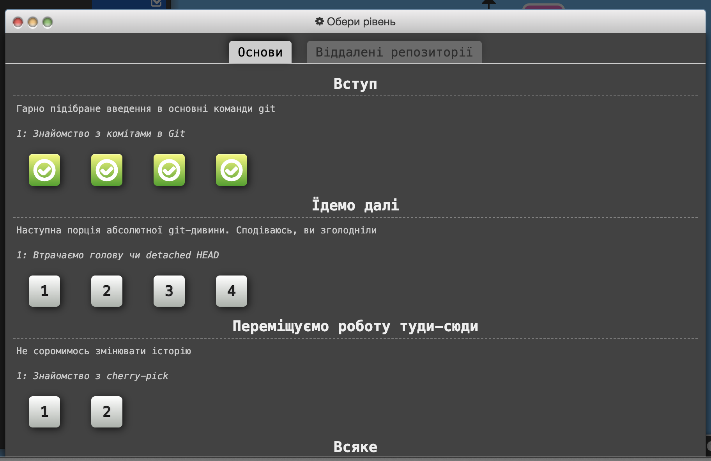

Screenshot

## 1.Linux CLI, and HTTP

Discovered a lot of new options in Linux CLI.

Screenshot

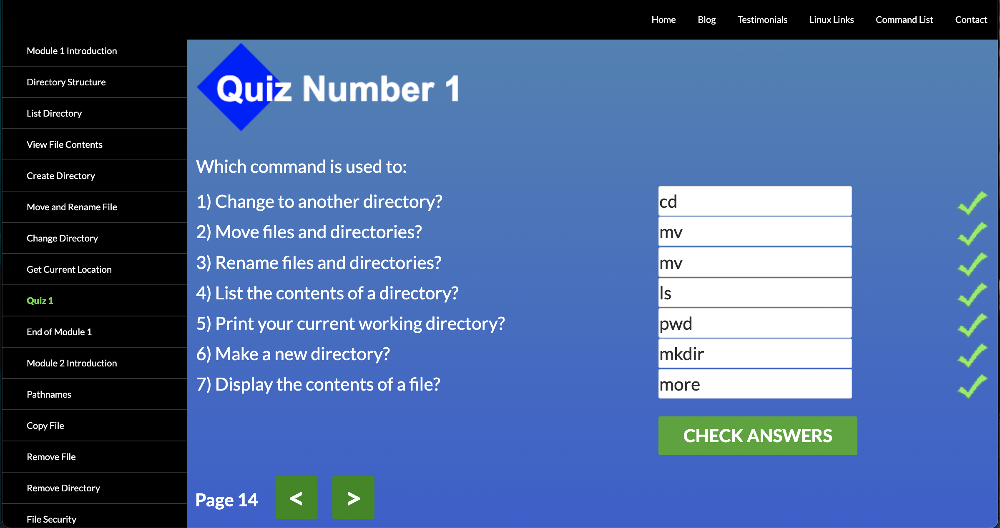

Screenshot

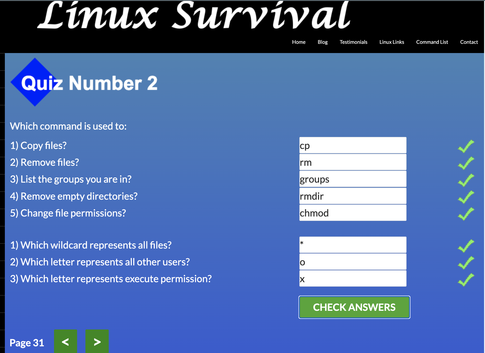

Screenshot

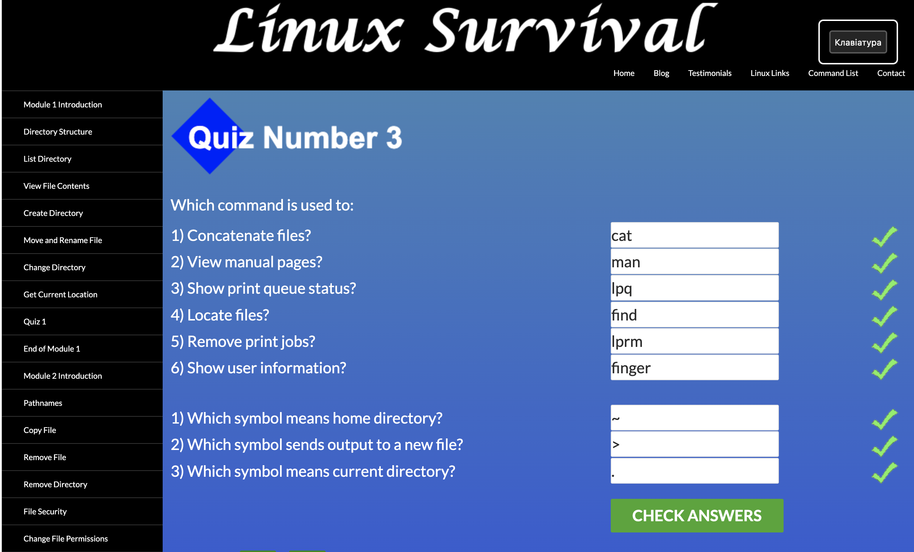

Screenshot

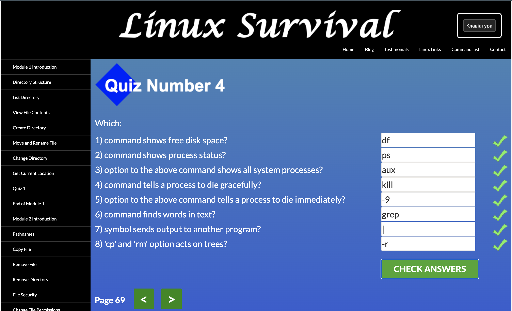

## 2.Git Collaboration

Screenshot

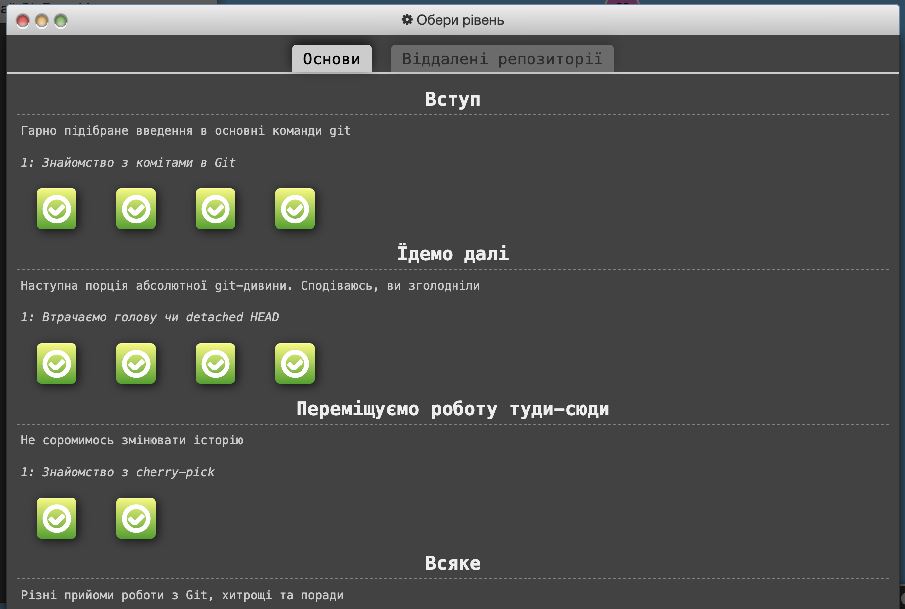

Screenshot

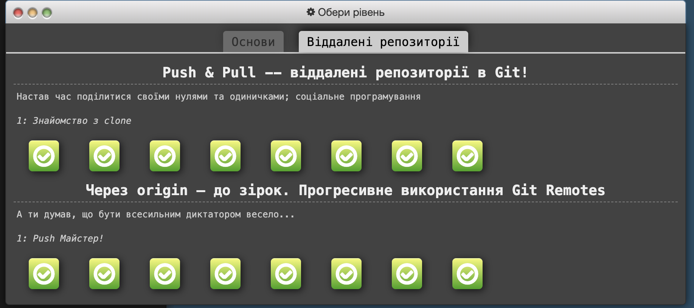

## **_Brief description:_**

- HEAD always points to the most recent commit from the working tree
- Detached HEAD simply means that HEAD refers to a commit, not a branch.
- `git branch -f main HEAD~3` Moves (force) the main branch three ancestors behind HEAD.
- `git branch -f main C6` Moves branch main to C6.
   _Reversing Changes_ 
- `git reset HEAD~1` will move the branch back, it will be look like commit has never exist.
- `git reset local~1` only for local changes (roll back changes and then share those rolled back changes with friends, you need to use git revert).
- `git revert pushed` cancel pushed branch.
   _Cherry-pick_ 
- `git cherry-pick <Коміт1><Коміт2><...>` when you know which commits you need (and you know their hash)
- `git push origin main` 'Піди в гілку, що називається "main" в моєму репозиторії, візьми всі коміти, піди у віддалений "main", що називається "origin". Додай ті коміти, яких немає в цій гілці і надрукуй, що саме ти зробив'

## 3.Intro to HTML and CSS

Screenshot

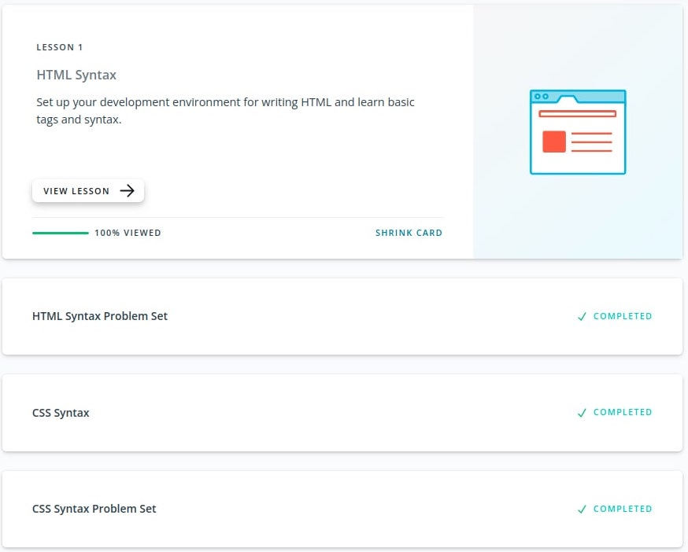

Screenshot

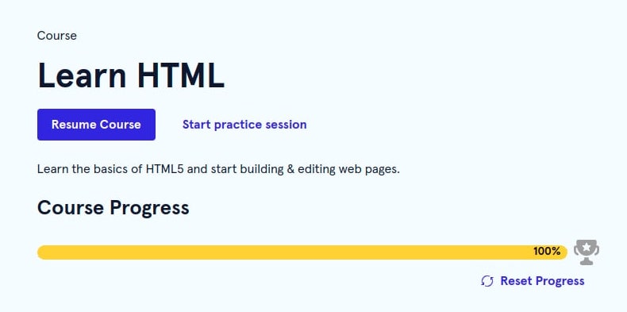

Screenshot

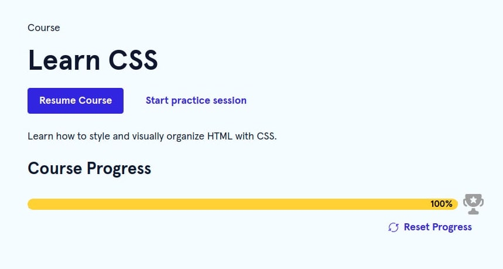

## 4.Responsive Web Design

Screenshot

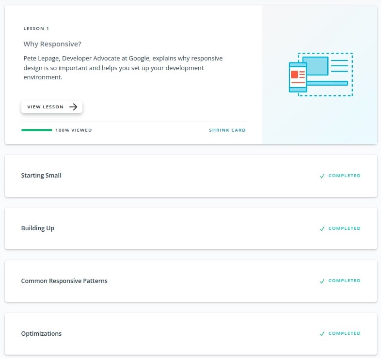

Screenshot

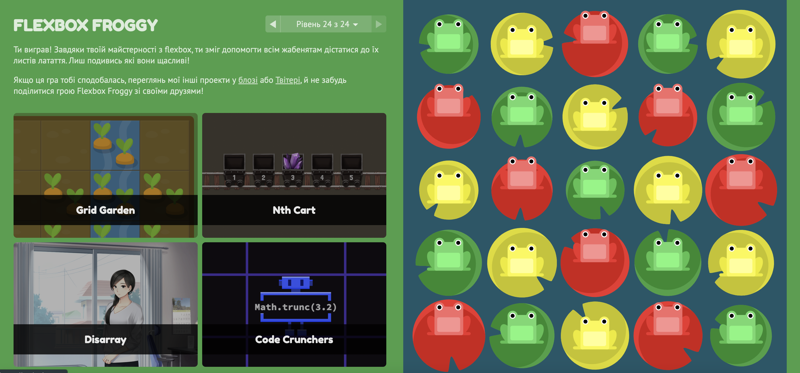

Screenshot

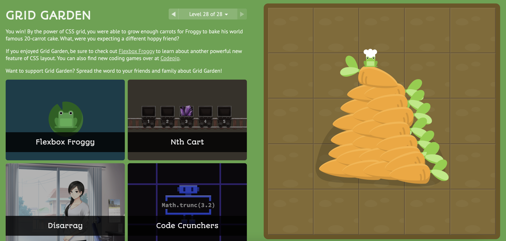

## 5. HTML & CSS Practice

[Demo Url](https://helengreent.github.io/kottans_task_html_css_popup/)

[Codebase](https://github.com/HelenGreent/kottans_task_html_css_popup.git)
